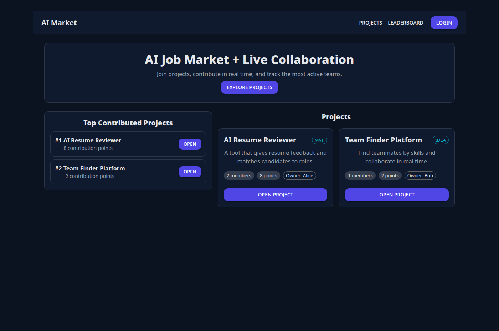
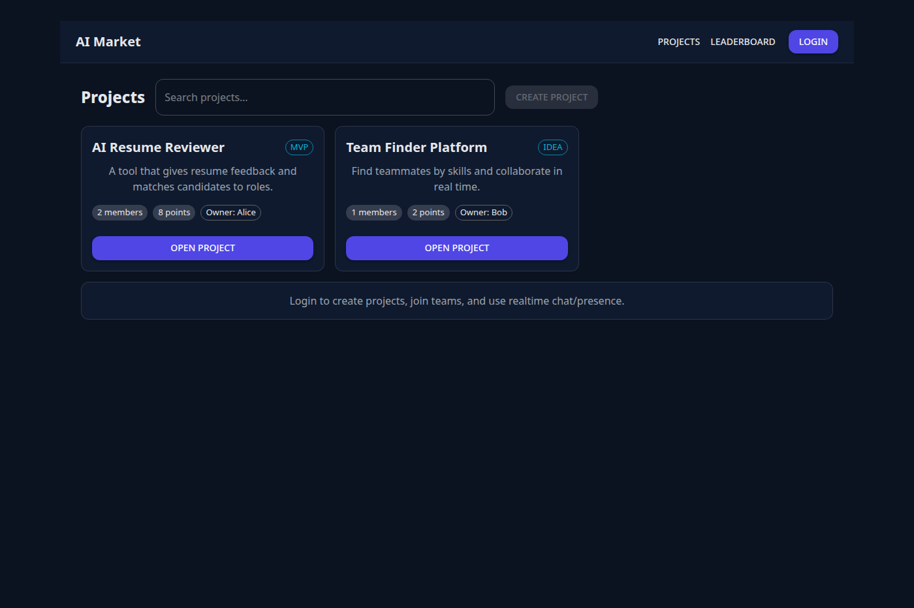
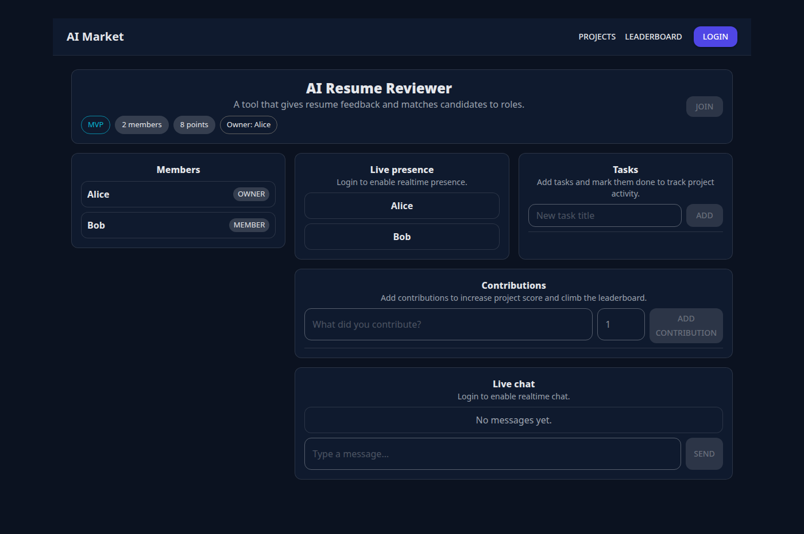

## AI Job Market + Collaboration Platform (Java + React)

This repo contains a full-stack **live collaboration platform**:

- **Backend**: Java 21, Spring Boot, PostgreSQL, JWT auth, WebSockets (STOMP) for presence/chat/notifications
- **Frontend**: React + TypeScript + MUI, real-time updates via WebSocket

### What you get

- User accounts + JWT authentication
- User profiles with skills
- Projects marketplace (create/join/members)
- **Live presence**: see who is currently in a project (real-time)
- Tasks + contributions
- **Top contributed projects** leaderboard
- Project chat (real-time)

### Screenshots

> These screenshots are generated from the real UI in **demo mode** (no backend required) so they stay reproducible in CI.

#### Dashboard (Leaderboard + projects)


#### Projects list


#### Project detail (presence + tasks + contributions + chat)


### Quick start (local)

1) Start Postgres

```bash
docker compose up -d
```

2) Run backend

```bash
cd backend
./mvnw spring-boot:run
```

If you **don’t have Docker/Postgres**, run the backend with the in-memory H2 profile:

```bash
cd backend
./mvnw spring-boot:run -Dspring-boot.run.profiles=dev
```

Backend: `http://localhost:8080`  
Swagger: `http://localhost:8080/swagger-ui/index.html`

#### Windows note (JAVA_HOME)

If `mvnw` fails on Windows with “JAVA_HOME is set to an invalid directory”, ensure `JAVA_HOME` points to your JDK folder **without quotes** (prefer Java 21).

3) Run frontend

```bash
cd frontend
npm install
npm run dev
```

Frontend: `http://localhost:5173`

### Seeded dev accounts

When running backend with profile `dev`, you can log in with:

- `alice@example.com` / `password123`
- `bob@example.com` / `password123`

### Generate screenshots (optional)

```bash
cd frontend
VITE_DEMO_MODE=true npm run build
node ../scripts/generate-screenshots.mjs
```

### Environment variables

Backend (optional overrides):
- `SPRING_DATASOURCE_URL` (default `jdbc:postgresql://localhost:5432/aimarket`)
- `SPRING_DATASOURCE_USERNAME` (default `aimarket`)
- `SPRING_DATASOURCE_PASSWORD` (default `aimarket`)
- `APP_JWT_SECRET` (default is for local dev only; change in production)

Frontend:
- `VITE_API_BASE_URL` (example `https://your-backend.example.com`)
- `VITE_DEMO_MODE` (`true` to run UI without backend for screenshots)

### Deploy to Vercel (frontend)

Vercel can deploy the **React frontend**. The **Java backend must be hosted elsewhere** (Render/Fly/Railway/etc).

- **Vercel settings**
  - Root Directory: `frontend`
  - Build Command: `npm run build`
  - Output Directory: `dist`
- **Vercel environment variables**
  - `VITE_API_BASE_URL`: your backend URL (for example `https://aimarket-backend.onrender.com`)


